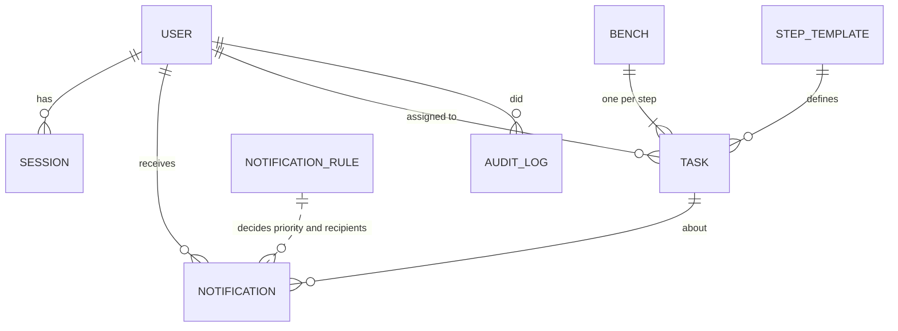
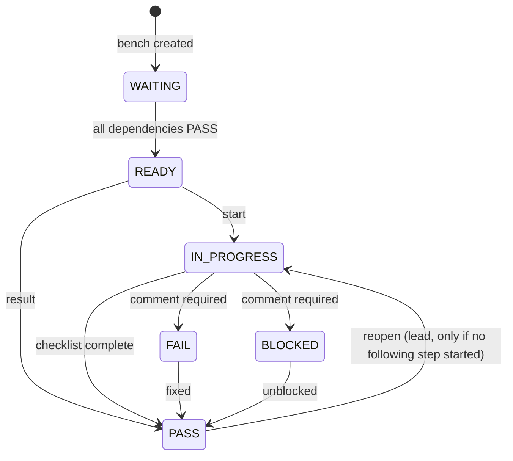

# Architecture and design decisions

## Overview

A server-rendered Python web application in four layers:

1. **Domain** (`app/domain`): pure rules without framework imports – process dependencies and readiness (`process.py`), notification events, default rules and inbox ordering (`notifications.py`), roles and the permission matrix (`roles.py`).
2. **Use cases** (`app/services`): `workflow.py` (create bench, start, submit result, assign, reopen, overdue check), `notify.py` (rules → recipients → notifications, auto-resolve, inbox), `auth.py`, `audit.py`. Each use case checks permissions first and commits once.
3. **Web** (`app/web`, `app/templates`, `app/static`): thin routes, sessions, CSRF, security headers, German/English texts.
4. **Data** (`app/models.py`, `app/db.py`): SQLAlchemy 2; PostgreSQL in production, SQLite for demo and tests.

## Data model

- `STEP_TEMPLATE`: code, discipline, dependencies, instructions and checklist (DE/EN).
- `TASK`: one per bench and step; status `WAITING → READY → IN_PROGRESS → PASS | FAIL | BLOCKED`.
- `NOTIFICATION_RULE`: per event type the priority (Urgent/Normal/Info/Off) and recipient roles.
- `NOTIFICATION`: per recipient; `read_at` (seen) and `resolved_at` (work done).

## Task states

## Decisions

### ADR 1 – Custom web app instead of only n8n / low-code

*Context:* The first prototype in n8n proved the notification logic, but role-based accounts, per-role dashboards and forms per step are hard to maintain in a workflow tool.
*Decision:* A small Python web app owns users, process state, dashboards and rules. n8n (or Power Automate) remains an optional integration layer for channels such as Microsoft Teams and for test bench networks.
*Consequences:* Full control over usability, security and tests; one more service to operate. The evaluation of low-code platforms (Power Platform, n8n) remains part of the thesis; this app is a reference implementation for comparing them.

### ADR 2 – Server-rendered HTML, minimal JavaScript

*Decision:* Jinja2 templates, one small script for polling and convenience. Every page works without JavaScript.
*Consequences:* Simple, fast on shop-floor tablets, strict CSP possible, easy to maintain for a small team.

### ADR 3 – Roles, not individuals, as notification recipients

*Decision:* Rules address *assignee / team / team lead / department lead / next team*. The concrete people come from the user directory.
*Consequences:* Team changes do not require rule changes; scales to many teams.

### ADR 4 – Priority from process state, configurable by the department lead

*Decision:* Urgent = something is broken and blocks others; Normal = it is your turn; Info = never interrupts. Inbox order: unread, priority, oldest first. Overdue tasks escalate.
*Consequences:* Predictable behaviour, no notification flood, fairness (FIFO within a priority).

### ADR 5 – Process as validated configuration

*Decision:* Steps, dependencies and checklists live in data (`StepTemplate`), validated for unknown references and cycles.
*Consequences:* New bench types without code changes (UI editor on the roadmap).

### ADR 6 – PostgreSQL in production, SQLite for demo/tests

*Decision:* SQLAlchemy abstracts both; Docker Compose runs PostgreSQL.
*Consequences:* Zero-setup demo and fast tests; production-grade database where it matters. Alembic migrations are on the roadmap.

### ADR 7 – Security by default

*Decision:* Argon2id, server-side sessions, CSRF on every form, strict CSP, permission checks in use cases, audit log, pinned and audited dependencies, non-root container.
*Consequences:* Suitable as a basis for an internal tool; SSO (Entra ID) is the next step for company use.
