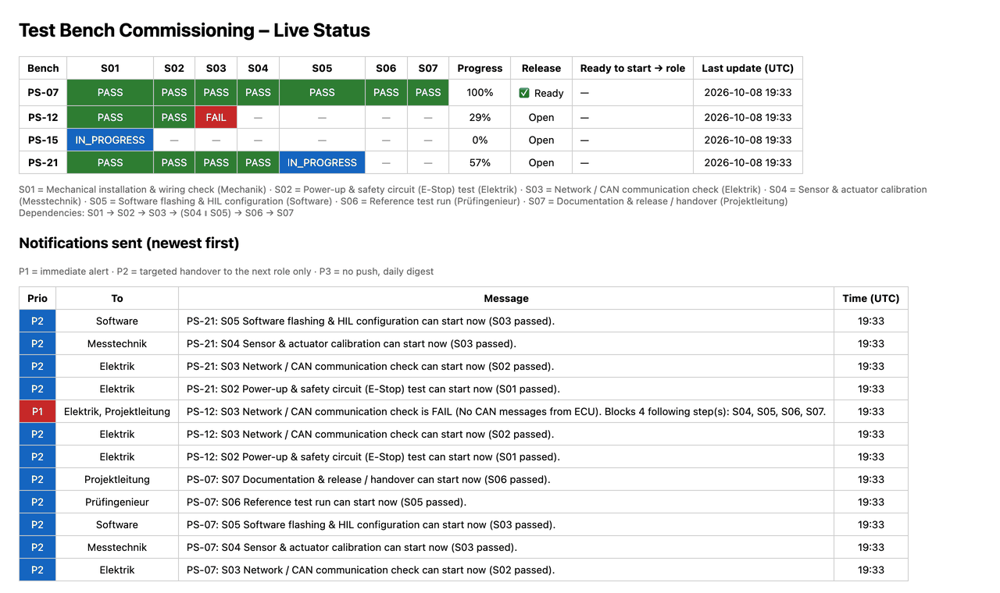
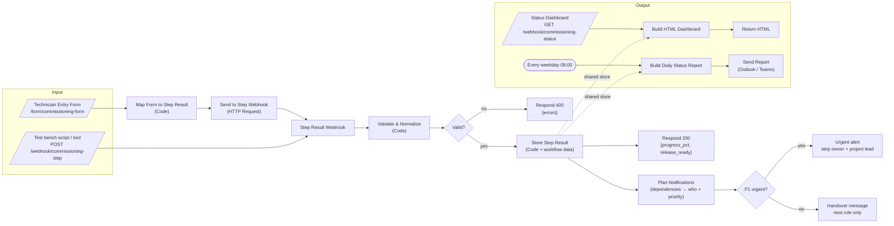
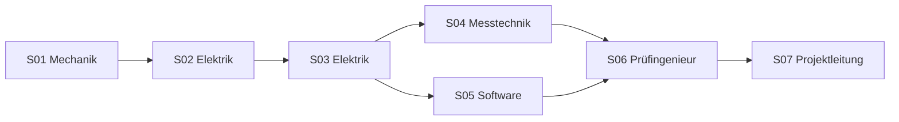
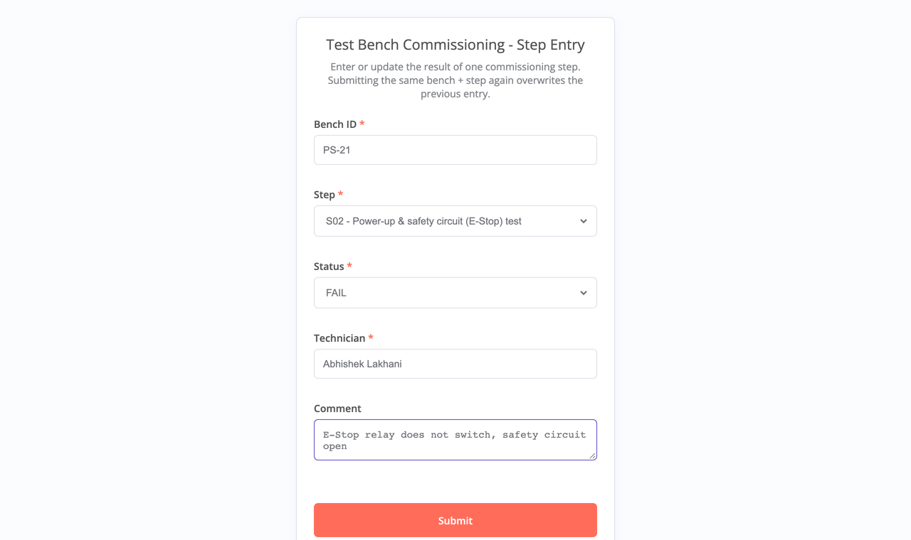
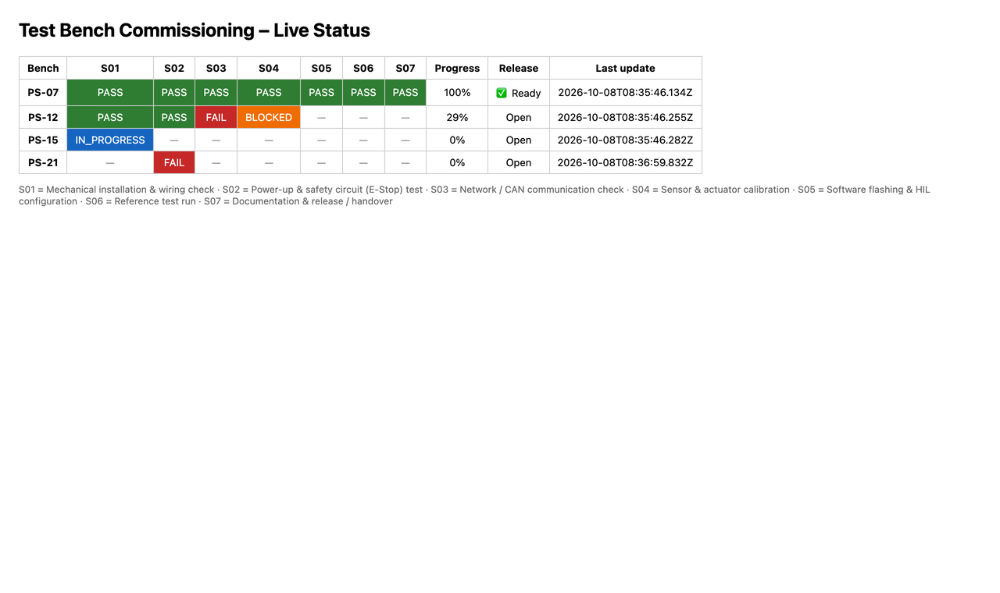

# n8n prototype – Test Bench Commissioning Tracker

> This is the first prototype of the idea, built in n8n. The full web application with user accounts and role dashboards is described in the [main README](../README.md). The n8n workflow can still be used as an integration layer (e.g. Microsoft Teams messages).

A low-code workflow automation that digitalizes the **commissioning process of test benches**: step results are captured through a web form or an HTTP API, validated and stored. The workflow knows **which step depends on which**, so it hands work over to the **next responsible role only** and escalates real blockers immediately. Everything is summarised in a live status dashboard and a daily status / release report.

Built with **[n8n](https://n8n.io)** (self-hosted workflow automation), JavaScript Code nodes and plain HTML.



---

## Table of contents

- [Problem statement](#problem-statement)
- [Solution](#solution)
- [Features](#features)
- [Architecture](#architecture)
- [Commissioning steps and data model](#commissioning-steps-and-data-model)
- [Screenshots](#screenshots)
- [Getting started](#getting-started)
- [API reference](#api-reference)
- [Project structure](#project-structure)
- [Design decisions](#design-decisions)
- [Limitations and roadmap](#limitations-and-roadmap)
- [Author](#author)

---

## Problem statement

Commissioning a test bench is a sequence of steps such as wiring checks, safety circuit tests, CAN communication, calibration, software flashing, a reference run and the final handover. In many engineering teams this process is still tracked with **Excel checklists, paper and e-mails**, which causes:

| Pain point | Effect |
|---|---|
| **Media breaks**: results are written on paper or in Excel, then re-typed or mailed | Duplicate work, transcription errors, no single source of truth |
| **No transparency**: project leads must ask "what is the status of bench PS-07?" | Status meetings and manual follow-ups |
| **Late failure detection**: nobody is actively notified when a step fails or is blocked | Waiting time, delayed handover |
| **Invisible dependencies**: the next person does not know that their step can start | Idle time between steps (waiting waste) |
| **Notification overload** if everyone is informed about everything | Important messages get ignored |
| **Manual reporting**: release / handover overviews are assembled by hand | Time-consuming and quickly outdated |

**Goal:** one digital workflow that captures every step result once, at the source, and automatically turns it into transparency: alerts, a live dashboard and status / release reports.

## Solution

| Requirement | Implementation |
|---|---|
| Capture step results without media breaks | **Web form** for technicians + **REST webhook** for scripts / test bench software |
| Data quality | Central validation (bench ID, step ID, status, technician); invalid requests get `HTTP 400` with a list of errors |
| Track execution and documentation | Every result is stored with technician, timestamp, comment and optional measurements, plus an audit log |
| Fast reaction to problems | `FAIL` / `BLOCKED` results trigger a **P1** alert to the step owner and project lead, listing every downstream step that is now blocked |
| Smooth handovers without notification flood | Dependency model (incl. parallel steps); when a step passes, only the role of the **newly unblocked** step gets one **P2** message. Everything else (**P3**) is not pushed, it appears in the dashboard and daily digest |
| Transparency | Live **HTML dashboard**: bench × step matrix, colour coded, progress in %, release flag |
| Automated status & release overview | **Scheduled report** every weekday at 08:00; a bench is *release-ready* when all steps are `PASS` |

## Features

- 4 entry points in one workflow: **Form**, **POST webhook**, **GET dashboard**, **Schedule (cron)**
- Enter **and update** results: submitting the same bench + step again overwrites the previous entry
- Input normalisation (e.g. `ps-15` becomes `PS-15`, `in_progress` becomes `IN_PROGRESS`)
- Progress calculation and automatic **release-ready** flag per bench
- **Dependency-aware, prioritised notifications** (P1 alert / P2 targeted handover / P3 digest only)
- **Parallel steps** supported: S04 and S05 start at the same time after S03; S06 waits for both
- "Ready to start → role" column so every role sees what it can work on next
- Daily status report (benches tracked, release-ready count, open issues per bench)
- Runs fully **self-hosted** (Docker or Node.js), so data stays inside the lab / company network
- Workflow stored as JSON, so it can be version-controlled and reviewed like code

## Architecture




**Flows**

| Flow | Trigger | Purpose |
|---|---|---|
| A: Step result | `POST /webhook/commissioning-step` | Validate → store → respond → plan notifications (P1 alert / P2 handover / P3 none) |
| B: Dashboard | `GET /webhook/commissioning-status` | Render the live status matrix as HTML |
| C: Daily report | Cron `0 8 * * 1-5` | Summarise progress, release-ready benches and open issues |
| D: Entry form | `GET/POST /form/commissioning-form` | Human-friendly input; forwards to Flow A via HTTP Request, so validation and storage logic exist only once |

## Commissioning steps and data model

| ID | Step |
|---|---|
| S01 | Mechanical installation & wiring check |
| S02 | Power-up & safety circuit (E-Stop) test |
| S03 | Network / CAN communication check |
| S04 | Sensor & actuator calibration |
| S05 | Software flashing & HIL configuration |
| S06 | Reference test run |
| S07 | Documentation & release / handover |

**Status values:** `PASS` · `FAIL` · `BLOCKED` · `IN_PROGRESS`

## Dependencies and prioritised notifications

In a large organisation, "notify the next person when my task is done" quickly turns into hundreds of messages that nobody reads. The workflow therefore decides **who** needs to know and **how urgent** it is.



| Priority | When | Who is notified | Channel |
|---|---|---|---|
| **P1** urgent | A step is `FAIL` or `BLOCKED` | Owner role of the step + project lead, with the list of blocked downstream steps | Immediate push (e.g. Teams) |
| **P2** handover | A step `PASS`es **and** a following step becomes startable (all its dependencies passed) | **Only** the role of the newly unblocked step | One targeted message |
| **P3** info | `IN_PROGRESS`, or a `PASS` that does not unblock anything yet | Nobody | Dashboard + daily digest only |

Example: when S04 passes but S05 is still running, **no message** is sent. When S05 passes too, only the *Prüfingenieur* receives "S06 can start now". Notifications are addressed to **roles**, not to individuals, so the mapping can follow team changes without touching the workflow.

```jsonc
// stored per bench
"PS-12": {
  "steps": {
    "S03": { "status": "FAIL", "technician": "M. Weber", "comment": "No CAN messages from ECU",
             "timestamp": "2026-10-08T08:35:46.255Z", "step_name": "Network / CAN communication check" }
  },
  "created_at": "...", "updated_at": "..."
}
```

## Screenshots

| Entry form | Live dashboard |
|---|---|
|  |  |

## Getting started

### Option 1: Docker (recommended)

```bash
git clone https://github.com/abhisheklakhani-it/n8n-test-bench-commissioning-tracker.git
cd n8n-test-bench-commissioning-tracker
docker compose --profile n8n up -d
# import + activate the workflow
docker exec n8n-commissioning-tracker n8n import:workflow --input=/n8n/workflows/commissioning_tracker_workflow.json
docker exec n8n-commissioning-tracker n8n publish:workflow --id=cmTracker0000001
docker restart n8n-commissioning-tracker
```

### Option 2: Node.js

```bash
npx n8n import:workflow --input=n8n/workflows/commissioning_tracker_workflow.json
npx n8n publish:workflow --id=cmTracker0000001
npx n8n start
```

Alternatively open `http://localhost:5678`, create the owner account, then **Import from File** → `n8n/workflows/commissioning_tracker_workflow.json` and switch the workflow to **Active / Published**.

### Try it

```bash
bash n8n/scripts/send_test_data.sh           # loads 3 sample benches + 1 invalid request
```

| What | URL |
|---|---|
| Entry form | http://localhost:5678/form/commissioning-form |
| Live dashboard | http://localhost:5678/webhook/commissioning-status |
| n8n editor / executions | http://localhost:5678 |

## API reference

### `POST /webhook/commissioning-step`

```bash
curl -X POST http://localhost:5678/webhook/commissioning-step \
  -H "Content-Type: application/json" \
  -d '{"bench_id":"PS-12","step_id":"S03","status":"FAIL","technician":"M. Weber",
       "comment":"No CAN messages from ECU","measurements":{"bus_load_pct":0}}'
```

| Field | Required | Description |
|---|---|---|
| `bench_id` | yes | Test bench identifier, e.g. `PS-07` |
| `step_id` | yes | `S01` … `S07` |
| `status` | yes | `PASS`, `FAIL`, `BLOCKED`, `IN_PROGRESS` (case-insensitive) |
| `technician` | yes | Person who executed the step |
| `comment` | no | Free text |
| `measurements` | no | Any JSON object (e.g. measured values) |

**Responses**

```json
200 {"ok":true,"bench_id":"PS-07","step_id":"S07","status":"PASS","progress_pct":100,"release_ready":true}
400 {"ok":false,"errors":["step_id must be one of S01, S02, ...","technician is required"]}
```

### `GET /webhook/commissioning-status`

Returns the HTML dashboard.

## Project structure

```
.
├── workflows/
│   └── commissioning_tracker_workflow.json   # n8n workflow (19 nodes, 4 triggers)
├── scripts/
│   └── send_test_data.sh                     # sample data + invalid request
├── docs/images/                              # demo GIF and screenshots
├── docker-compose.yml                        # self-hosted n8n
└── README.md
```

## Design decisions

- **One validation path.** The form does not duplicate the logic; it forwards to the same webhook as machines do. n8n also does not allow *Respond to Webhook* nodes in form-started executions, so this keeps both entry points clean.
- **Validate at the entry point.** Bad data is rejected with a clear message instead of polluting the dashboard.
- **Code nodes only where they add value.** Validation, aggregation and HTML rendering are in small, named JavaScript nodes; routing uses standard IF nodes so the flow stays readable for non-developers.
- **Notify by dependency and priority, not by default.** Only blockers are pushed immediately; handovers go to one role; everything else is pulled from the dashboard. This keeps the signal-to-noise ratio high as the number of benches and people grows.
- **Placeholders for notifications.** Alert and report nodes are No-Op nodes, so the workflow runs without credentials; swap them for *Microsoft Teams*, *Outlook* or *Slack* nodes.
- **Self-hosted.** Can run inside an isolated lab network next to the test benches; only aggregated status needs to leave it.

## Limitations and roadmap

**Current limitations**
- Storage uses n8n workflow static data (demo-grade: persisted only for active / production executions, no concurrent-write control).
- Webhooks have no authentication yet.
- The step list, dependencies and role mapping are defined in the Code nodes (one shared block).

**Roadmap**
- [ ] Persist results in **SharePoint / Microsoft Lists or PostgreSQL** (and feed Power BI)
- [ ] Replace placeholders with **Microsoft Teams** alerts and **Outlook** daily report
- [ ] **Approval step** for release (n8n *Wait* node with resume link) before a bench is marked ready
- [ ] Checklist **templates per bench type** loaded from a config table
- [ ] Header-auth / Entra ID protection for webhooks, HTTPS behind a reverse proxy
- [ ] Error workflow (Error Trigger) for operational monitoring
- [ ] KPIs: lead time per bench, time-to-detect failures, number of manual handovers

## Author

**Abhishek Lakhani**
M.Sc. Automotive Software Engineering, TU Chemnitz
[GitHub](https://github.com/abhisheklakhani-it)

## License

[MIT](../LICENSE) © 2026 Abhishek Lakhani
